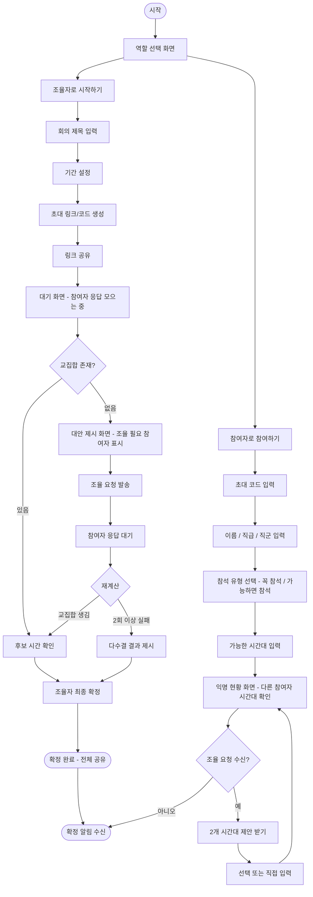

# User Flow

---

## 다이어그램에 포함하지 않은 예외 분기

다이어그램은 happy path와 핵심 분기(교집합 유무, 조율 요청 수신 여부)만 담는다. 그 외 예외 처리는 화면 단위 디테일이라 [feature-spec.md](feature-spec.md)에서 관리한다.

- 잘못된/만료된 초대 코드 입력 (→ 9번 화면)
- 이미 확정된 회의의 코드로 참여 시도 (→ 9번 화면, 확정 알림으로 바로 이동)
- 전원 미응답 상태 또는 마감 시각 도달 시 결과 확인 (→ 3, 4번 화면)
- 조율 요청에 끝까지 무응답 → 계산에서 제외 (→ 6, 13번 화면)
- 다수결 동점 → 이른 시간대 기본 표시, 조율자 최종 선택 (→ 7번 화면)
- 확정 전 시간대 재입력 (→ 11번 화면)
